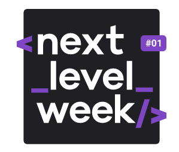
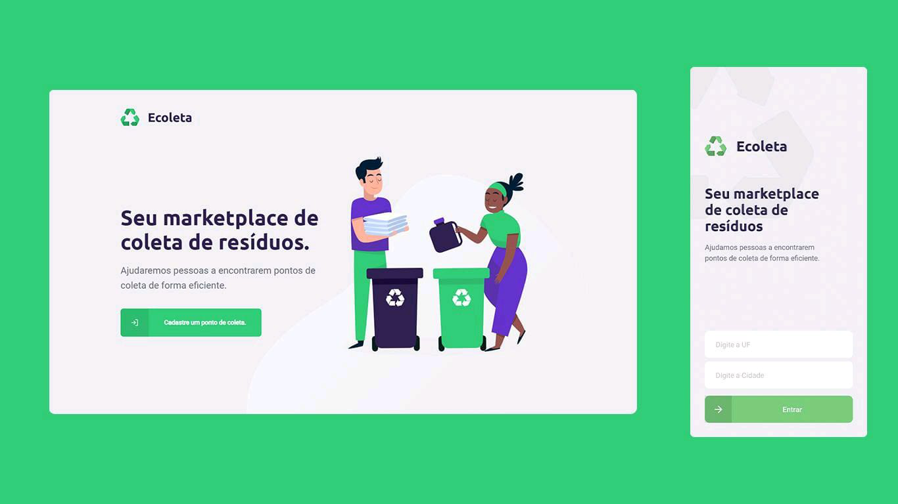

<h1 align="center">
    
</h1>

<p align="center">
  

  
	
  <a href="https://www.linkedin.com/in/gabriel-orlando-07266a117/">
    
  </a>

  <a href="https://github.com/index325/nlw1_projeto/commits/master">
    
  </a>
   <a href="https://github.com/index325/nlw1_projeto/stargazers">
    
  </a>
</p>

#### If you need support with the content, go to my [Notion notes](https://www.notion.so/NLW-6fe8f579d7ec49018926d0c81d546325)


## :information_source: What's Next Level Week?

NLW is a practical week with lots of code, challenges, networking and a single objective: to take you to the next level.
Through our method you will learn new tools, learn about new technologies and discover hacks that will boost your career.
An online and completely free event that will help you take the next step in your evolution as a dev.

## 💻 Project

Ecoleta is a project developed based on international environment week. 
That aims to connect people to companies that collect specific waste such as light bulbs, batteries, cooking oil, etc.

<h1 align="center">
    
</h1>


## :rocket: Technologies

This project was developed with the following technologies:

- Node.js
- TypeScript
- React

## 🔖 Layout

To access the layout use [Figma](https://www.figma.com/file/1SxgOMojOB2zYT0Mdk28lB/).

## :information_source: How To Use

To clone and run this application, you'll need [Git](https://git-scm.com), [Node.js](https://nodejs.org/en/) installed on your computer.

From your command line:

### Install API 

```bash
# Clone this repository
$ git clone https://github.com/index325/next-level-week-1.0

# Go into the repository
$ cd next-level-week-1.0/server

# Install dependencies
$ npm install

# Run Migrates
$ npm knex:migrate

# Run Seeds
$ npm knex:seed

# Start server
$ npm run dev

# running on port 3333
```

### Install Front-end

```bash
# Clone this repository
$ git clone https://github.com/nymalone/next-level-week-1.0

# Go into the repository
$ cd next-level-week-1.0/web

# Install dependencies
$ npm install

# Run
$ npm start

# running on port 3000
```


Made with ♥ by Gabriel Orlando :wave: [Contact me!](https://www.linkedin.com/in/gabriel-orlando-07266a117/)
